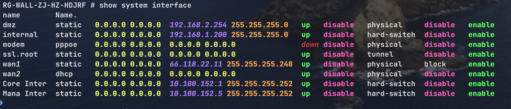
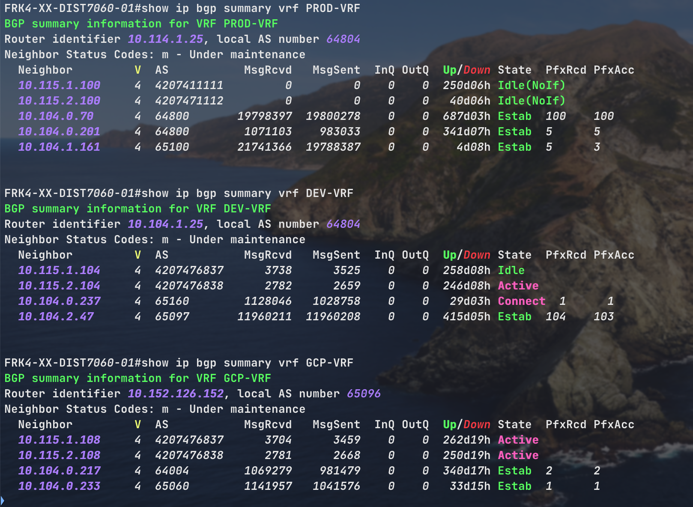
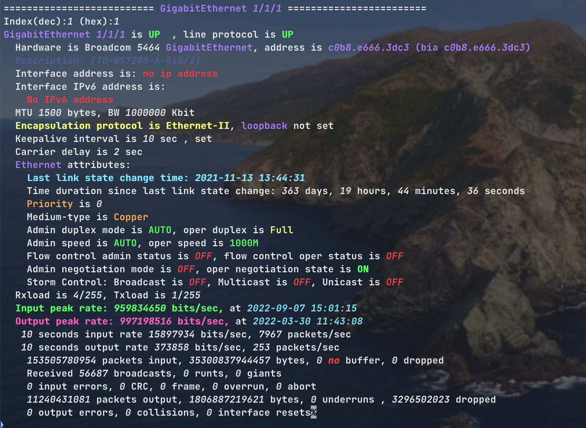
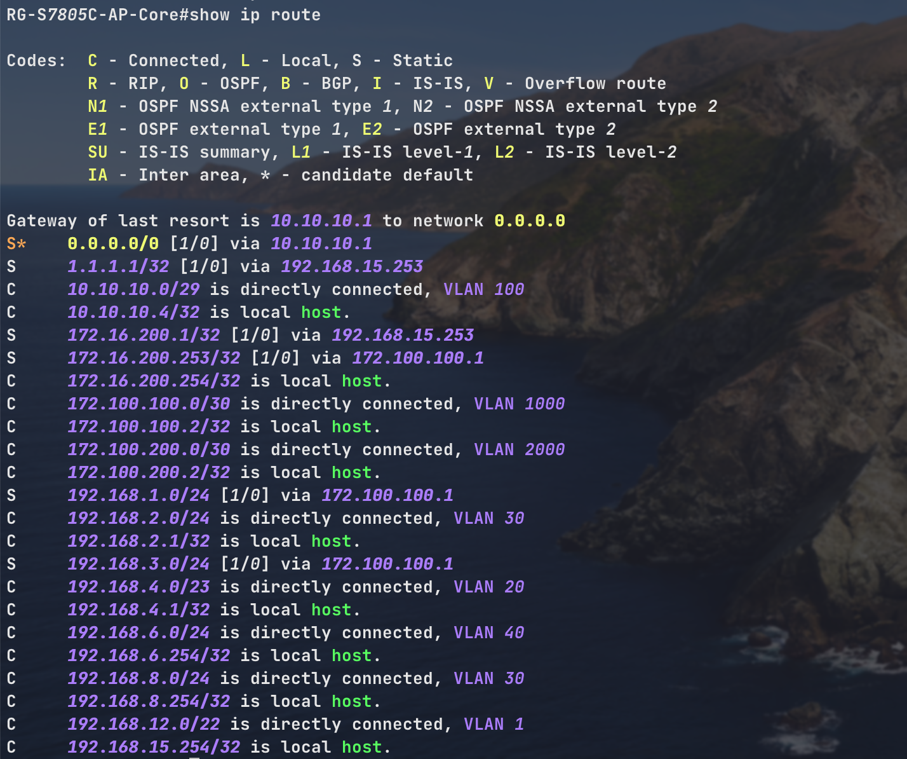

<!--
 * @Author: Kerwin
 * @Date: 2022-09-30 15:16:12
 * @LastEditTime: 2022-11-05 12:24:52
 * @FilePath: /KERWIN/Users/kerwin/Dropbox/GitHub/netcli-highlight-Dracula/README.md
 * @Description: 
 * 
 * Copyright (c) 2022 by Kerwin All Rights Reserved. 
-->
# netcli-highlight

**TLDR:** This repo will help you to make use of syntax highlighting on Live Network devices. (/RuijieJuniper/Cisco/Arista)

## TOC

- [netcli-highlight](#netcli-highlight)
  - [TOC](#toc)
  - [What's this about?](#whats-this-about)
  - [Use-cases](#use-cases)
  - [Benefits](#benefits)
  - [Pre-requisites](#pre-requisites)
  - [Usage](#usage)
    - [Persistence](#persistence)
  - [Test](#test)
  - [Highlight Rules](#highlight-rules)
    - [Description](#description)
    - [RegEx](#regex)
    - [Color](#color)
      - [Background and Foreground](#background-and-foreground)
      - [Style](#style)
    - [Group](#group)
    - [Exclusive](#exclusive)
  - [Palette](#palette)
  - [PCRE2](#pcre2)
  - [Help](#help)
    - [Windows support](#windows-support)
  - [Special Thanks](#special-thanks)

## What's this about?

If you have ever used the CLI on network devices, you probably have ended up frustrated trying to make sense of the long lines of configuration. Although nowadays the use of editors like `vim/Sublime/Vscode/Atom` can provide some really useful syntax highlighting, you still can find yourself struggling to read the config files or outputs while you are on live devices.


**Wouldn't be nice to have some live syntax highlight to differentiate each component and quickly find what you are looking for?** Something like...



If you are like me, fascinated by the concept of **marginal gains**, this guide will help you to work more efficiently in the CLI.

The purpose of this repo is to give you an idea of the power of having syntax highlighting while working on live devices. This is not by any means a full-blown syntax highlighting solution but a way to show you how you can take advantage of it and adapt it to your needs.

**Note:** The default color code has been tested using a Dark terminal Background as you can see in the images above

## Use-cases

- **Reading show ip bgp summary (Ruijie / Cisco / Arista)**


- **Reading show interfaces (Cisco / Ruijie / Arista / JunOS)**


- **Reading ip route (Ruijie / Cisco / Arista)**



## Benefits

- Quicker troubleshooting as you can easily identify missconfigurations or issues like interfaces down.

- Color codes can be totally customised to your liking. To see the available HTML color codes go [HERE](https://htmlcolorcodes.com/)
- Regex can be adapted to  your particular Network OS (NOS) and version.

## Pre-requisites

- Python 3.7+ Recommended
- [Chromaterm](https://github.com/hSaria/ChromaTerm) - A big shout out to **[hSaria](https://github.com/hSaria)** for buliding this wonderful tool that even work with interactive applications such as ssh/telnet.

## Usage

- Clone this repo: `git clone git@github.com:KerwinKwong/netcli-highlight-Dracula.git`
- Get inside the project: `cd netcli-highlight-Dracula/`
- Install the following package: `pip3 install chromaterm`
- Copy the config file to your home dir: `cp .chromaterm.yml ~/.chromaterm.yml`
- If you use **bash** as your shell, issue: `echo 'ssh() { /usr/bin/ssh "$@" | ct; }' >> ~/.bash_profile`
- If you use **zsh** as your shell, issue: `echo 'ssh() { /usr/bin/ssh "$@" | ct; }' >> ~/.zshrc`
- Prefix your command with ct. It's that simple.`ct ssh somewhere` , `ct ssh somewhere` or `ct screen somewhere`

### Persistence

To always highlight a program, set up an alias in your `.bash_profile`. For
instance, here's one for `ssh`.

```shell
alias ssh="ct ssh"
or/and
alias telnet="ct telnet"
```

If you want to highlight your entire terminal, have ChromaTerm spawn your shell by
modifying the shell command in your terminal's settings to `/usr/local/bin/ct /bin/bash --login`.
Replace `/bin/bash` with your shell of choice.

## Test

- To test, open a new window in you terminal, use one of the following examples provided in the test/ folder and pipe it to chromaterm. For example: `cat tests/arista_pref_list.txt | ct`
- Last, connect to a `Ruijie|Juniper|Arista|Cisco` via ssh and issue a `show interfaces`

## Highlight Rules

ChromaTerm reads highlight rules from a YAML configuration file, formatted like so:

```yaml
rules:
- description: Obligatory "Hello, World"
  regex: Hello,?\s+World
  color: f#ff0000

- description: Spit some facts (emphasize "NOT" so they get it)
  regex: Pineapple does (NOT) belong on pizza
  color:
    0: bold
    1: blink italic underline
```

The configuration file can be placed in one of the locations below. The first one
found is used.

 * `$HOME/.chromaterm.yml`
 * `$XDG_CONFIG_HOME/chromaterm/chromaterm.yml` (`$XDG_CONFIG_HOME` defaults to
 `$HOME/.config`)
 * `/etc/chromaterm/chromaterm.yml`

If no file is found, a default one is created in your home directory.

> Check out [`rules`](https://github.com/KerwinKwong/netcli-highlight-Dracula/tree/main/rules);
> it has some topic-specific rules that are not included in the defaults.

### Description

Optional. It's purely for your sake.

### RegEx

The RegEx engine used is Python's [re](https://docs.python.org/3/library/re.html),
but it can be switched to PCRE2 (see relevant section below).

### Color

#### Background and Foreground

The color is a hex string prefixed by `b` for background (e.g. `b#123456`) and
`f` for foreground (e.g. `f#abcdef`).

#### Style

In addition to the background and foreground, you can also use `blink`, `bold`,
`invert`, `italic`, `strike`, and `underline`. Though, not all terminals support
those styles; you might not see their effects.

### Group

Colors can be applied per RegEx group (see the 2nd example rule). Any group in
the RegEx can be referenced, including group `0` (entire match) and
[named groups](https://docs.python.org/3/howto/regex.html#non-capturing-and-named-groups).

### Exclusive

When multiple rules match the same text, ChromaTerm highlights the text with all
of the colors of the matching rules. If you want the text to be highlighted only
by the first rule that matches it, use the `exclusive` flag.

```yaml
- regex: hello
  color: bold
  exclusive: true
```

In the code above, no other rule will highlight `hello`, unless it comes first
and has the `exclusive` flag set.

## Palette

You can define colors in a palette and reference them by name. For instance:

```yaml
palette:
  # Created from https://coolors.co/9140f5-bd5df6-e879f6
  purple-1: '#9140f5'
  purple-2: '#bd5df6'
  purple-3: '#e879f6'

rules:
- regex: hello
  color: f.purple-1

- regex: hi
  color: b.purple-3
```

When referencing a palette color, prefix it with `b.` for background and `f.` for
foreground.

## PCRE2

If the `PCRE2` library is present, you can use it instead of Python's `re`
engine. When present, an option in `ct -h` becomes available.

While the performance improvement is significant (~2x), the two RegEx engines
have a few differences; use this option only if you have a good understanding
of their unique features.

> The default rules work on both engines.

## Help

If you've got any questions or suggestions, please open up an
[issue](https://github.com/hSaria/ChromaTerm/issues/new/choose) (always
appreciated).

### Windows support

To use ChromaTerm on Windows, you will need to run it with the
[Windows Subsystem for Linux (`WSL`)](https://docs.microsoft.com/en-us/windows/wsl/about)


## Special Thanks

Thanks to [danielmacuare](https://github.com/danielmacuare) for creating this fantastic tool [netcli-highlight](https://github.com/danielmacuare/netcli-highlight).

Thanks to [hSaria](https://github.com/hSaria) for creating this fantastic tool [Chromaterm](https://github.com/hSaria/ChromaTerm).
